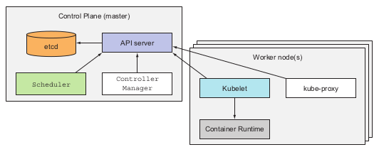

# Introdução

Kubernetes (k8s) é um orquestrador de containers que nos permite gerenciar aplicações
containerizadas sem a necessidade de conhecer os detalhes da infraestrutura
inerente. Com ele podemos implantar aplicações em diversas máquinas, tratando-as
como se fossem um único recurso computacional. Essa abstração facilita todo o
processo de implantação e sustentação tanto para os times de desenvolvimento
quanto para os times de operação.

*O k8s trata todas as máquinas como um único recurso computacional*

## Arquitetura

Um cluster k8s é composto por uma ou mais máquinas (ou *nodes*), que podem ser
separadas em duas categorias:

* Um *master node* que possui os componentes essenciais para gerenciar o cluster
* *worker nodes* que executam as aplicações de fato

*Componentes de um cluster k8s*

## Benefícios

Com o k8s, os times de desenvolvimento ganham mais autonomia, uma vez que os
times de operações não são mais necessários para fazer o deploy das aplicações.
Como os containers empacotam a aplicação e suas dependências, os sysadmins não
precisam instalar nenhum software adicional.

Isso não quer dizer que os times de operação não são mais necessários: manter um
cluster, mesmo em serviços gerenciados (EKS, GKE...) requer um grande esforço.
A diferença é que os times se tornam mais independentes

### Simplifica o deploy das aplicações

Uma vez que tratamos todos os recursos do cluster como um único "computador
gigante", não é necessário conhecimento sobre os servidores aonde as aplicações
irão rodar.

Quando os desenvolvedores querem subir uma aplicação, o hardware onde essa aplicação
irá executar não é relevante, desde que este possua os recursos necessários para
atendê-la. Apesar disso, ainda é possível especificar necessidades das
aplicações caso os nodes do cluster sejam heterogêneos: Aplicações com mais
acessos em disco podem ser escalonadas para nodes que rodam com SSDs, por exemplo.

### Otimização de uso de hardware

Com o Kubernetes, as aplicações são desacopladas da infraestrutura: como
pessoas desenvolvedoras, especificamos apenas as necessidades da aplicação, e o
próprio k8s se encarrega de alocar os recursos no cluster de forma apropriada
com base nos requisitos e nos recursos disponíveis em cada node

### *Healthchecking* e auto-recuperação

Uma vez que temos um sistema que nos permite mover workloads entre nodes de
forma transparente, o cluster se torna mais resiliente. O Kubernetes monitora as
aplicações e o hardware em que elas rodam, e tem a capacidade de realocar os
sistemas num evento de falha ou manutenção de alguma máquina
