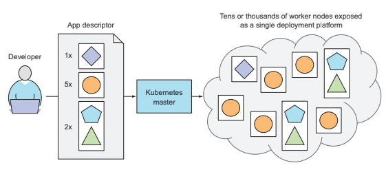

# Introdução

Kubernetes (k8s) é um orquestrador de containers que nos permite gerenciar aplicações
containerizadas sem a necessidade de conhecer os detalhes da infraestrutura
inerente. Com ele podemos implantar aplicações em diversas máquinas, tratando-as
como se fossem um único recurso computacional. Essa abstração facilita todo o
processo de implantação e sustentação tanto para os times de desenvolvimento
quanto para os times de operação.

*O k8s trata todas as máquinas como um único recurso computacional*

## Arquitetura

